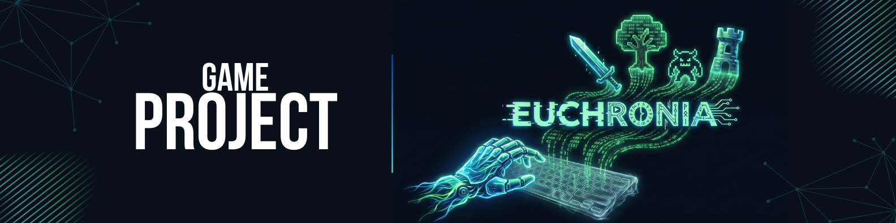

<h1 align="center"> </h1>

<p align="center">
  
  
  
  
  
</p>

---


> 🜏 *Um RPG de terminal que une Programação Orientada a Objetos, narrativa procedural e Inteligência Artificial para criar um mundo vivo e imprevisível.*

---

<h2 align="center"> 📜 Sobre o Projeto </h2>


**Euchronia** é um RPG de terminal em Python que combina:
- ⚙️ **POO estruturada** para um núcleo limpo e expansível.  
- ⚔️ **Combate estratégico por turnos com Action Time** e precisão probabilística.  
- 💎 **Buffs, debuffs, controle e habilidades configuráveis** via JSON.  
- 🧠 **Integração com IA (OpenAI)** para narrativa adaptativa e geração procedural.  

O resultado é uma engine narrativa de RPG que **reage às ações do jogador** — cada escolha molda o mundo.

---

<h2 align="center"> 🧱 Estrutura do Projeto </h2>

    EUCHRONIA/
    │
    ├── euchronia/
    │   ├── models.py          # Classes: Player, Enemy, AliveModel
    │   ├── combat_logic.py    # Sistema de combate e skills
    │   ├── game_logic.py      # HUD, menus e exploração
    │   └── ai_services.py     # (futuro) integração com IA
    │
    ├── data/
    │   ├── classes.json       # Classes jogáveis
    │   ├── skills.json        # Habilidades e efeitos
    │   ├── itens.json         # Armas, poções e equipamentos
    │   ├── enemy.json         # Inimigos e loot tables
    │   └── mapconfig/ 
    │        ├── gps_map.json       # Conexões entre regiões
    │        ├── map.txt
    │        └── atlas.json         # Locais do mundo
    │
    ├── saves/                 # Dados persistentes do jogador
    ├── docs/                  # GDD e documentação
    │   └── RPG - EUCHRONIA.pdf
    ├── main.py
    ├── requirements.txt
    └── README.md   

---

<h2 align="center"> ⚔️ Mecânica de Combate </h2>
Action Time: a velocidade define a ordem de ataque, com variação aleatória a cada rodada.

Precisão probabilística:

    MISS (erro total)
        
    SCRATCH (dano reduzido)
        
    HIT (dano completo)

Fórmula balanceada de dano:

    defense_reduction = defense / (defense + 100)
    damage_final = damage * (1 - defense_reduction)

---

<h2 align="center"> 🧩 Skills são categorizadas em: </h2>

  Tipo	Exemplo	Efeito
  ATTACK	Golpe Pesado	Dano físico direto
  BUFF	Grito de Batalha	Aumenta força ou defesa
  DEBUFF	Adagas Envenenadas	Reduz defesa ou aplica veneno
  CONTROL	Prisão de Gelo	Paralisa o inimigo

Todas configuradas em skills.json — expansíveis sem alterar o código.
 
 ---
 
<h2 align="center"> 🎮 Prévia de Combate (Terminal) </h2>

```
  ──────────────────────────────────────────────────────────────
  👤 Herói (Lv 3)        ❤️ HP: 78/100   ⚔️ STR: 12   🛡 DEF: 9
  vs
  🐀 Rato Gigante        ❤️ HP: 0/25      ☠️ DERROTADO
  ──────────────────────────────────────────────────────────────
  💥 Golpe Pesado causa 23 de dano crítico!
  🧪 Efeito “Sangramento” aplicado por 3 turnos!
  🩸 O inimigo sofre 4 de dano residual.
  ──────────────────────────────────────────────────────────────
  🏆 Vitória! +15 XP | Loot: Pele de Rato (x1)
  ──────────────────────────────────────────────────────────────
```

Interface otimizada para cores com rich e termcolor, incluindo HUD dinâmica com Live() e logs coloridos.

---

<h2 align="center"> 🧠 Arquitetura POO </h2>

```

  Classe	             Função	                   Destaque
  AliveModel	        Entidades       vivas	HP, força, defesa, efeitos
  PlayerModel	        Jogador	        Inventário, XP, level, equips
  EnemyModel	        Inimigos	      Dados carregados de enemy.json
  CombatManager	      (planejado)	    Controla rodada e ordem de turnos

```

Cada entidade pode aplicar, atualizar e remover efeitos temporários de combate (buffs, debuffs, status).

---

<h2 align="center"> 🌍 Mundo e Exploração </h2>

* Baseado em grafo de conexões (gps_map.json), cada nó é uma região explorável.

* O atlas contém lore, bioma e inimigos locais.

* O jogador pode viajar, explorar e enfrentar batalhas aleatórias em cada zona.

---

<h2 align="center"> 💾 Saves e Persistência </h2>

O progresso do jogador é salvo em saves/, incluindo:

    * Status e nível atual
    
    * Inventário e equipamentos
    
    * Efeitos ativos e buffs
    
    * Localização no mapa
    
    * player.save("saves/slot_1.json") / player.load("saves/slot_1.json")

---

<h2 align="center"> 🚀 Instalação e Execução </h2>

1️⃣ Clonar o repositório

    git clone https://github.com/TheTekig/EUCHORNIA.git
    cd EUCHORNIA
    
2️⃣ Criar ambiente virtual

    python -m venv venv
    source venv/bin/activate  # Linux/Mac
    venv\Scripts\activate     # Windows
    
3️⃣ Instalar dependências

    pip install -r requirements.txt
    
4️⃣ Executar o jogo

    python main.py

---

<h2 align="center"> 📅 Histórico de Versões & Roadmap </h2>

Abaixo, a evolução do desenvolvimento do **Euchronia**, desde a concepção da engine até o lançamento planejado.

| Versão | Status | 🚩 Título da Atualização | 🛠️ Principais Implementações |
| :---: | :---: | :--- | :--- |
| **v0.1.0** | ✅ | **The Genesis**<br>*(Out/2025)* | • Estrutura POO Core (`AliveModel`, `Player`)<br>• Arquitetura Data-Driven (JSON)<br>• Menu Principal via Terminal |
| **v0.2.0** | ✅ | **Tactical Update**<br>*(Nov/2025)* | • Combate "Action Time" (Velocidade dinâmica)<br>• Skills com tipos (Buff/Debuff/Control)<br>• Sistema de Mapas em Grafo (`gps_map`) |
| **v0.3.0** | ✅ | **AI Dungeon Master**<br>*(Dez/2025)* | • Integração OpenAI API (`ai_services`)<br>• Geração Procedural (Inimigos/Itens)<br>• Sistema de Resumo de Lore (Memória) |
| **v0.4.0** | 🚀 **Atual** | **The Explorer's Journal**<br>*(Dez/2025)* | • Sistema de Save/Load robusto<br>• Mapas Visuais (PNG) e ASCII<br>• Inventário e Equipamentos funcionais |
| **v0.5.0** | 🔄 | **Society & Economy**<br>*(Em Breve)* | • Sistema de Mercantes (`market.py`)<br>• NPCs Interativos e Diálogos<br>• Quest Log (`campaign.json`) |
| **v0.6.0** | 🔜 | **The Strategist**<br>*(Planejado)* | • Menu de "Grimório" (Gerenciar Skills)<br>• Balanceamento de Combate<br>• Limite de slots de habilidades |
| **v1.0.0** | 🏁 | **Euchronia Awakening**<br>*(Lançamento)* | • Tratamento de erros de API (Fallback)<br>• Documentação Final<br>• Release Oficial |

---

<h2 align="center"> 🧙 Autor </h2>

<h2 align="center"> Diogo Teodoro Dias Lamas </h2>

    🎮 Desenvolvedor & Criador do universo Euchronia
    📦 GitHub: @TheTekig
    
💬 “A fronteira entre o código e o imaginário é o que dá vida a Euchronia.”

<p align="center"> 📜 Licença </p>
<p align="center"> Distribuído sob MIT License — sinta-se livre para modificar, estudar e expandir o projeto.</p>

<p align="center"> 🌒 <i>“Cada bug conta uma história. Cada linha, uma nova era de Euchronia.”</i> 🌘 </p> 
